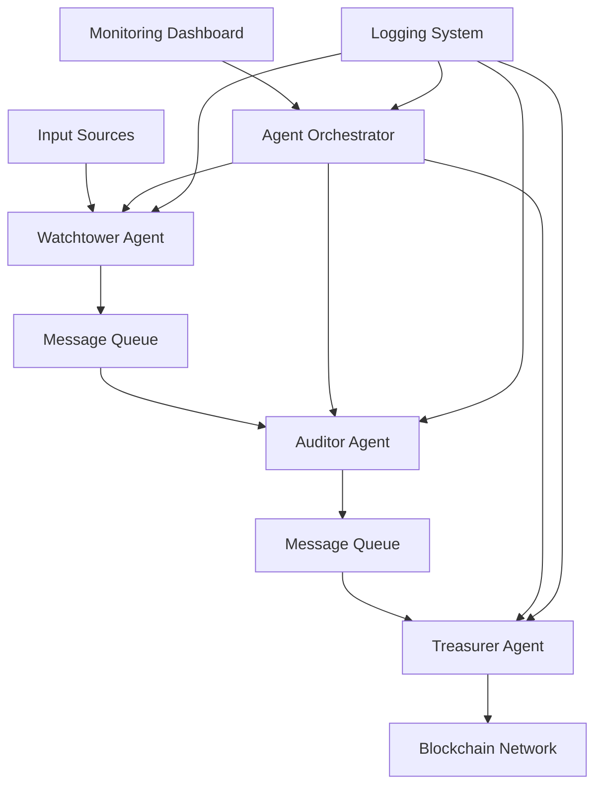
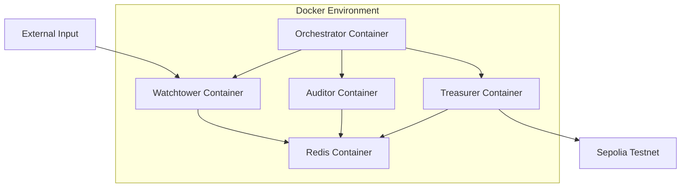

# Design Document

## Overview

The Disaster Management System is a microservices-based architecture featuring three specialized AI agents that communicate through message queues. The system processes visual data through a pipeline: detection → verification → funding, with each stage handled by a dedicated agent. The architecture supports containerized deployment, blockchain integration, and real-time monitoring.

## Architecture

### High-Level Architecture



### Technology Stack

- **Runtime**: Python 3.9+ with asyncio for concurrent processing
- **AI/ML Framework**: PyTorch for computer vision models, OpenCV for image processing
- **Blockchain**: Web3.py for Ethereum/Sepolia testnet integration
- **Message Queue**: Redis for inter-agent communication
- **Containerization**: Docker and Docker Compose for orchestration
- **Agent Framework**: Custom implementation based on asyncio with message passing
- **Monitoring**: Python logging with structured JSON output
- **Configuration**: YAML-based configuration files

### Deployment Architecture



## Components and Interfaces

### Watchtower Agent

**Purpose**: Process satellite/drone imagery to detect disaster scenarios

**Core Components**:
- Image preprocessing pipeline using OpenCV
- Pre-trained CNN models for disaster detection (fire, flood, structural damage)
- Object detection for human casualties using YOLO or similar
- Geolocation extraction from image metadata
- Confidence scoring system

**Input Interface**:
```python
class ImageInput:
    image_data: bytes
    timestamp: datetime
    coordinates: Optional[Tuple[float, float]]
    source_type: str  # "satellite" | "drone"
    metadata: Dict[str, Any]
```

**Output Interface**:
```python
class DisasterEvent:
    event_id: str
    disaster_type: str  # "fire" | "flood" | "structural" | "casualty"
    severity_score: float  # 0.0 to 1.0
    coordinates: Tuple[float, float]
    confidence: float
    timestamp: datetime
    image_analysis: Dict[str, Any]
```

### Auditor Agent

**Purpose**: Verify disaster events using advanced ML models and cross-validation

**Core Components**:
- Multi-model ensemble for disaster verification
- Historical data comparison engine
- False positive detection algorithms
- Human impact assessment models
- Verification scoring system

**Input Interface**:
```python
class DisasterEvent:  # Same as Watchtower output
    # ... (inherited from Watchtower)
```

**Output Interface**:
```python
class VerifiedEvent:
    event_id: str
    original_event: DisasterEvent
    verification_score: int  # 0-100
    human_impact_estimate: int
    funding_recommendation: float
    verification_timestamp: datetime
    audit_details: Dict[str, Any]
```

### Treasurer Agent

**Purpose**: Execute blockchain transactions for disaster funding

**Core Components**:
- Web3 integration for Sepolia testnet
- Smart contract interaction layer
- Funding calculation algorithms
- Transaction management and retry logic
- Multi-recipient distribution system

**Input Interface**:
```python
class VerifiedEvent:  # Same as Auditor output
    # ... (inherited from Auditor)
```

**Output Interface**:
```python
class FundingTransaction:
    transaction_id: str
    event_id: str
    recipient_addresses: List[str]
    amounts: List[float]
    transaction_hashes: List[str]
    total_amount: float
    status: str  # "pending" | "confirmed" | "failed"
    timestamp: datetime
```

### Agent Orchestrator

**Purpose**: Coordinate agent lifecycle and communication

**Core Components**:
- Agent process management
- Health monitoring and restart logic
- Message routing between agents
- Configuration management
- Performance metrics collection

**Key Interfaces**:
```python
class AgentStatus:
    agent_name: str
    status: str  # "running" | "stopped" | "error"
    last_heartbeat: datetime
    processed_count: int
    error_count: int

class OrchestrationConfig:
    agents: Dict[str, AgentConfig]
    message_queues: Dict[str, QueueConfig]
    monitoring: MonitoringConfig
    blockchain: BlockchainConfig
```

## Data Models

### Core Data Structures

```python
# Configuration Models
@dataclass
class AgentConfig:
    name: str
    image: str
    environment: Dict[str, str]
    resources: ResourceLimits
    restart_policy: str

@dataclass
class BlockchainConfig:
    network_url: str
    private_key: str
    contract_addresses: Dict[str, str]
    gas_limit: int
    gas_price: int

# Processing Models
@dataclass
class ProcessingMetrics:
    agent_name: str
    processing_time: float
    queue_size: int
    success_rate: float
    timestamp: datetime

# Message Queue Models
@dataclass
class QueueMessage:
    message_id: str
    sender: str
    recipient: str
    payload: Dict[str, Any]
    timestamp: datetime
    retry_count: int
```

### Database Schema (Redis)

```
# Agent Status
agent:{agent_name}:status -> JSON(AgentStatus)
agent:{agent_name}:metrics -> JSON(ProcessingMetrics)

# Message Queues
queue:{queue_name} -> List[QueueMessage]
queue:{queue_name}:dlq -> List[QueueMessage]  # Dead letter queue

# Event Tracking
event:{event_id}:status -> JSON(EventStatus)
event:{event_id}:history -> List[ProcessingStep]

# Transaction Records
transaction:{tx_id} -> JSON(FundingTransaction)
```

## Error Handling

### Agent-Level Error Handling

1. **Input Validation Errors**:
   - Invalid image formats → Log error, skip processing
   - Missing metadata → Use defaults, continue processing
   - Malformed coordinates → Reject event, notify orchestrator

2. **Processing Errors**:
   - Model inference failures → Retry with fallback model
   - Memory/resource exhaustion → Restart agent container
   - Network timeouts → Exponential backoff retry

3. **Communication Errors**:
   - Message queue failures → Store in local buffer, retry
   - Agent unavailability → Route to dead letter queue
   - Orchestrator disconnection → Continue autonomous operation

### System-Level Error Handling

1. **Container Failures**:
   - Automatic restart with exponential backoff
   - Health check failures trigger container replacement
   - Resource limit breaches cause graceful shutdown

2. **Blockchain Errors**:
   - Network congestion → Increase gas price, retry
   - Insufficient funds → Alert administrators, queue transaction
   - Smart contract failures → Log error, manual intervention required

3. **Data Consistency**:
   - Message deduplication using event IDs
   - Idempotent transaction processing
   - Audit trail for all state changes

## Testing Strategy

### Unit Testing

- **Watchtower Agent**: Mock image inputs, verify disaster detection accuracy
- **Auditor Agent**: Test verification algorithms with known datasets
- **Treasurer Agent**: Mock blockchain interactions, test transaction logic
- **Orchestrator**: Test agent lifecycle management and message routing

### Integration Testing

- **End-to-End Pipeline**: Process sample disaster images through complete system
- **Message Queue Testing**: Verify reliable message delivery between agents
- **Blockchain Integration**: Test transactions on Sepolia testnet
- **Container Orchestration**: Verify Docker Compose deployment and scaling

### Performance Testing

- **Throughput Testing**: Process multiple concurrent disaster events
- **Latency Testing**: Measure end-to-end processing times
- **Resource Usage**: Monitor CPU, memory, and network utilization
- **Failure Recovery**: Test system behavior under various failure scenarios

### Acceptance Testing

- **Disaster Detection Accuracy**: Validate against labeled disaster datasets
- **False Positive Rate**: Ensure verification system filters invalid events
- **Transaction Reliability**: Confirm successful funding distribution
- **System Availability**: Verify 99%+ uptime under normal conditions